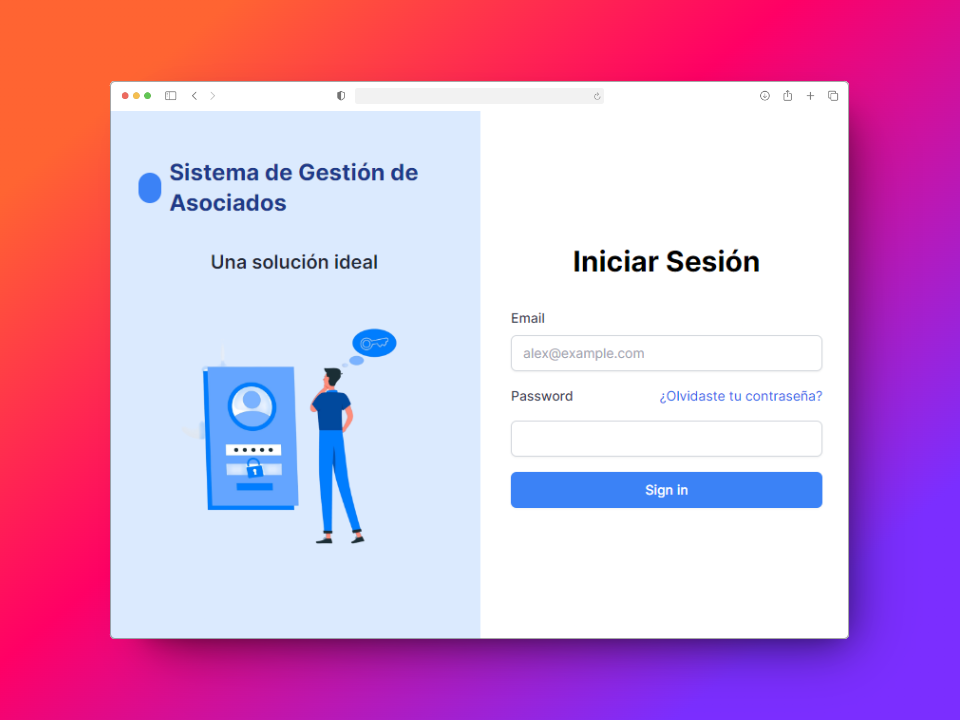
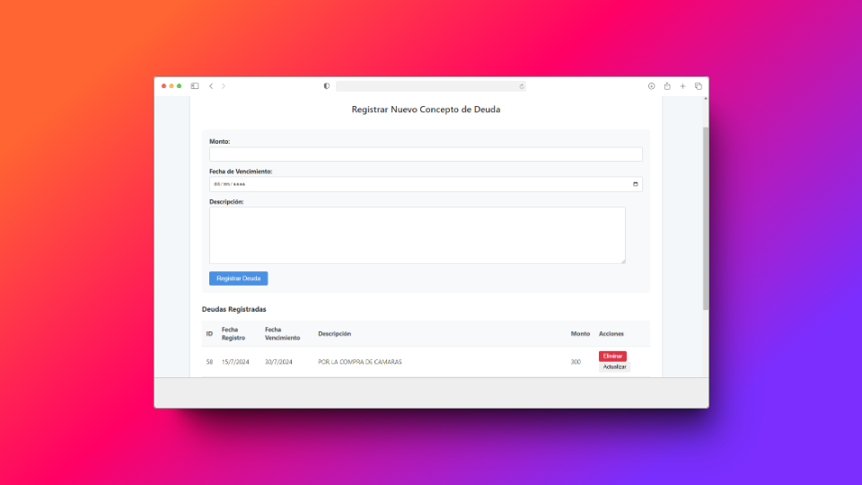
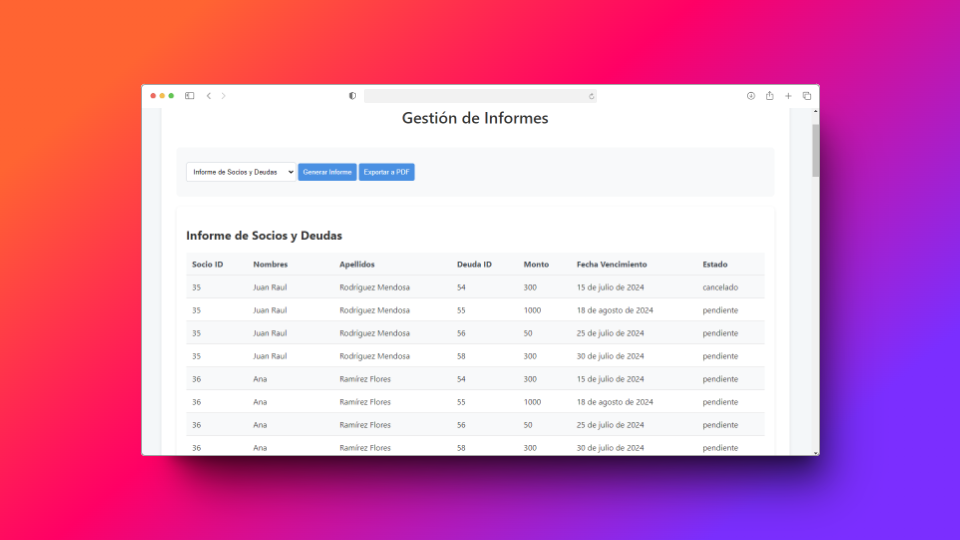

# 🎉 **Electron App - Gestión de Asociados** 🎉

## 📜 **Descripción**

Esta aplicación de escritorio está desarrollada en **Electron** y tiene como objetivo gestionar los pagos y deudas de los socios. La interfaz es intuitiva y permite a los usuarios administrar sus pagos de manera eficiente.

## 🚀 **Funcionalidades**

- **Gestión de Socios**: Selección de socios y visualización de sus deudas.
- **Cálculo de Pagos**: Cálculo del monto total a pagar, considerando un 10% adicional si la fecha de vencimiento ha pasado.
- **Indicadores Visuales**: Las deudas vencidas se resaltan en rojo para una fácil identificación.

## 📸 **Capturas de Pantalla**

### 🖥️ Login


### 📊 Gestión de Deudas


### 🚨 Resaltado de Deudas Vencidas



1. Clonar el repositorio:

   ```bash
   git clone https://github.com/tu_usuario/tu_repositorio.git
